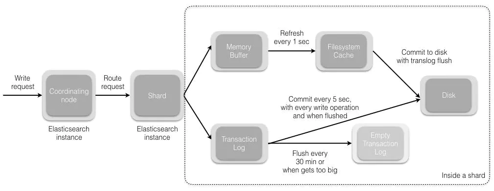
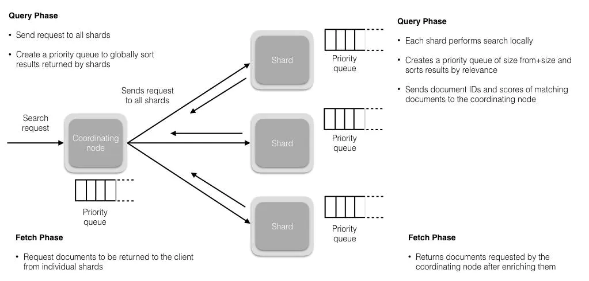

1. 为什么ES快？简要介绍下与RDB的区别？

- 本地缓存（第一次慢，后面就很快）
- 底层采用了倒排索引（存储引擎类似）
- 分布式处理（数据量大、并发量大的时候很有优势）

2. 如何保证`unique index`在es中的存储？

- http request里加参数`op_type = create`，如果存在改字段就报错
- 新建一个字段和`_id`关联

3. 如何实现子查询等复杂功能？

[全家桶](https://blog.csdn.net/wangxiaotongfan/category_5593095.html)

4. ES如何实现master结点选举的？

- 有ZenDiscovery模块负责，包含Ping和Unicast
- 对于node.master:true的结点按nodeId排序，每个node选择0号作为自己投票对象
- 当候选node票数过半的时候就可以成为master
`master主要负责管理集群、node和index，不负责管理文档；data node做这些事，还可以选择关闭http功能`

5. 描述一下ES索引文档的过程？

- 接收到一个write请求之后，协调结点负责选择合适的shard，路由计算公式`shard = hash(doc_id) % (num_of_primary_shard)`
- shard接收到请求之后，会把请求写入到memory buffer，然后定时写入到filesystem cache里，这个过程叫`refresh`,间隔为`1s`
- 为了保证有时候memory buffer和fs cache中数据可能会丢失，es提供了一个translog来保证数据传输可靠性。
基本原理是在在fs cache的数据写入到disk之后在清楚translog，这个过程为`flush`
- flush每30min定时触发一次或translog变得太大（521M）

6. 描述一下Update/Delete操作的过程？

- 本质上都是一个写操作，因为es中的文档是不可变的
- 执行delete操作只是在该文档所在段对应的.del文件中标记为删除状态，查询的时候可以查得到，但是会被过滤掉
当执行merge操作的时候，删除状态的文件就不会被写入新的segment
- 同理，update的时候是把旧文档在.del文件中标记位删除，新版本文档被索引到新的segment

7. 描述一下es搜索的过程？

大致分为`Query`和`Fetch`两个阶段：

- Query：
  - 用户查询请求会被广播到index里的每一个shard copy（主分片或者副本分片）。每个分片都会在本地执行搜索并构建一个匹配文档大小
为from+size的优先队列。`搜索会查询fs chche，但还是有部分数据在memory buffer，因此只能说是近实时的`
  - 分片返回自己的检索结果`文档id和排序值`给协调结点，协调结点merge产生一个全局排序结果`存在priorityQueue中`
- Fetch：
  - 协调结点挑选哪些数据需要取，然后向相关的shard提交GET请求取文档
  - 都取完之后，返回数据给用户

8. 如何保证高并发情况下的读写一致性？

- 类似于数据库里的乐观锁来实现并发控制，确保新版本不会被旧版本覆盖
- 对于写操作，当只有集群大部分分片可用的时候才允许写。如果写失败，则副本会被认为是故障的，分片会在一个不同的节点上创建
- 对于读操作，默认是replication：sync，也就是主副分片都完成才返回，可以设成async，或者_preference为primary只查询主分片，保证查询为最新值

9. es中restHighLevelClient和Java Low Level REST Client有什么区别（包括性能）？

- restHighLevelClient基于 low level rest client进行了更上层的封装，low level需要自己拼装http请求的url和body, high level有现成的api方法可以直接使用；
- 两者都基于http协议， 性能上没有多大差异，基于底层的low稍微好一点。

10. 倒排索引讲一下呗？
