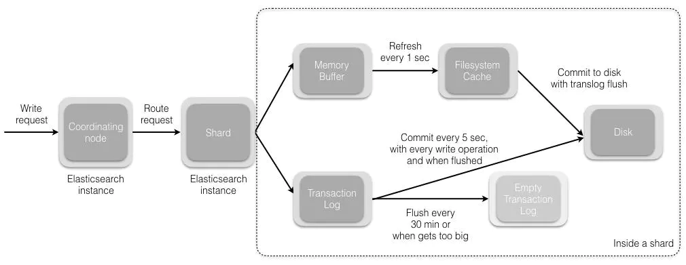
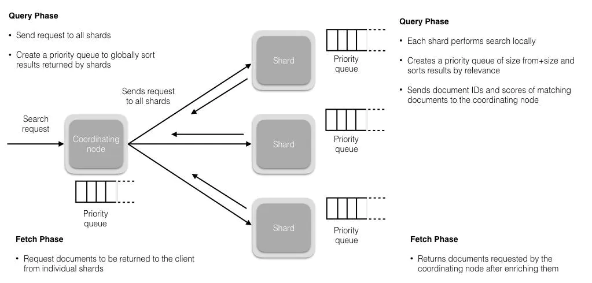

1. 为什么ES快？简要介绍下与RDB的区别？说一说ES的基础架构

为什么快：
- 本地缓存杀手锏fs cache（第一次慢，后面就很快）参考6,7
- 底层采用了倒排索引（存储引擎类似）
- 分布式处理（数据量大、并发量大的时候很有优势）

**区别**：

- 本质上来讲，es不是关系型数据库，每一个index不需要满足数据库建表的三大范式
- 从存储上来讲，es不是很适合用来数据存储，一来因为不支持事务无法支持crash-safe（尽管有translog但也只能部分恢复），而传统RDB例如MySql就提供了redolog, undolog等来保证；
二来因为底层采用Lucene存储机制，一切的优化都是为了提升检索效率；再者就是es的分片机制可以有效保证数据的高可用
再者就是mappings不可改，项目开始时难以确定shard number等导致后期扩容reindex的时候很麻烦。
- 从数据的读写上来讲，es的写入过程涉及到一个buffer的refresh和flush，而refresh的最小间隔是1s，也就是说写入的数据最少需要1s才能被搜索到，
因此在搜索实时性要求较高的场景下es不是最优选择
- 从数据检索效率上来讲，es底层采用Lucene的检索机制，可以保证非常快的数据检索速度，与此同时，应对海量数据并发检索，es的分布式架构就能非常好的利用硬件资源从而提升吞吐量
- es快是因为用到了内存来进行读写，并且其中使用到了cache的概念，因此其性能也会受到硬件资源的限制
- 从生态上来讲，都是开源的

**基础架构**：

- es存储数据的基本单位是index，做个不太准确的类比，index就对应于sql db中的一张表
index中的mappings就存储的各种字段以及其数据类型
- index又可以拆分成一个个shard，个数是在我们新建index的时候指定的，每个shard存储部分数据
这样带来的好处就是，数据量很大的情况下，可以**横向扩展**（扩展shard个数再reindex），再来就是可以**利用分布式的特性提高吞吐量和性能**
- 为了实现**高可用**，每个shard有分为`primary shard`和`replica shard`，且不会存储在同一个es实例上，
此外还有结点（master和非master）宕机处理方案（哨兵模式选举master等）
从而保证了高可用，不怕集群中某个机器宕机。

2. 如何保证`unique index`在es中的存储？

- http request里加参数`op_type = create`，如果存在改字段就报错
- 新建一个字段和`_id`关联

3. 如何实现子查询等复杂功能？

aggregation：Parent/Sibling Pipeline [官方文档](https://www.elastic.co/guide/en/elasticsearch/reference/current/search-aggregations-pipeline.html)
[全家桶](https://blog.csdn.net/wangxiaotongfan/category_5593095.html)

4. ES如何实现master结点选举的？脑裂是什么？怎么避免？

- 有ZenDiscovery模块负责，包含Ping和Unicast
- 对于node.master:true的结点按nodeId排序，每个node选择0号作为自己投票对象
- 当候选node票数过半的时候就可以成为master
`master主要负责管理集群、node和index，不负责管理文档；data node做这些事，还可以选择关闭http功能`

脑裂：
- 网络问题 -- 节点间网络异常造成集群发生物理分离，造成脑裂问题
- 节点负载 -- 如果 master 节点负载过高，则可能造成 master 节点停止响应，从而脱离集群，集群重新选主，恢复响应后出现脑裂问题

解决：
- 集群尽量部署在同一个内网环境中，从而保证各节点通讯的可靠性
- master 节点与 data 节点分离，从而保证 master 节点的响应能力
- 单播/多播
- 最少包含Master节点数与存活检测时长

5. 描述一下ES索引文档的过程？

- 接收到一个write请求之后，**协调结点**负责选择合适的shard，路由计算公式`shard = hash(doc_id) % (num_of_primary_shard)`
- 假设分配到shard0，则有shard0主分片所在节点来完成数据写入操作
- 主分片写入完成后，会请求将数据写入到shard0的replica分片上，成功则返回

6. 描述一下Write/Update/Delete操作的底层原理？

- 数据写入的底层原理
    - shard接收到请求之后，会把请求写入到memory buffer，然后定时写入到filesystem cache里，这个过程叫`refresh`,间隔为`1s`
    - 为了应对有时候memory buffer和fs cache中数据可能会丢失，es提供了一个translog来保证数据传输可靠性。
    基本原理是在在fs cache的数据写入到disk之后再清除translog，这个过程为`flush`（有点类似MySQL里InnoDB的redolog工作流程）
    `flush每30min定时触发一次或translog变得太大（521M）`
- Update/Delete
    - 本质上都是一个写操作，因为es中的文档是不可变的
    - 执行delete操作只是在该文档所在段对应的.del文件中标记为删除状态，查询的时候可以查得到，但是会被过滤掉
    当执行merge操作的时候，删除状态的文件就不会被写入新的segment
    - 同理，update的时候是把旧文档在.del文件中标记位删除，新版本文档被索引到新的segment

7. 描述一下es搜索的过程？

大致分为`Query`和`Fetch`两个阶段：

- Query：
  - 用户查询请求会被广播到index里的每一个shard copy（主分片或者副本分片）。每个分片都会在本地执行搜索并构建一个匹配文档大小
为from+size的优先队列。`搜索会查询fs chche，但还是有部分数据在memory buffer，因此只能说是近实时的`
  - 分片返回自己的检索结果`文档id和排序值`给协调结点，协调结点merge产生一个全局排序结果`存在priorityQueue中`
- Fetch：
  - 协调结点挑选哪些数据需要取，然后向相关的shard提交GET请求取文档
  - 都取完之后，返回数据给用户 

8. 如何保证高并发情况下的读写一致性？

- 类似于数据库里的乐观锁来实现并发控制，确保新版本不会被旧版本覆盖
- 对于写操作，当只有集群大部分分片可用的时候才允许写。如果写失败，则副本会被认为是故障的，分片会在一个不同的节点上创建
- 对于读操作，默认是replication：sync，也就是主副分片都完成才返回，可以设成async，或者_preference为primary只查询主分片，保证查询为最新值

9. es中restHighLevelClient和Java Low Level REST Client有什么区别（包括性能）？

- restHighLevelClient基于 low level rest client进行了更上层的封装，low level需要自己拼装http请求的url和body, high level有现成的api方法可以直接使用；
- 两者都基于http协议，性能上没有多大差异，基于底层的low稍微好一点。

10. 倒排索引讲一下呗？

[图](../images/inverse-index.jpg)

11. keyword关键字讲一下？

- 只能用来匹配精确值，不支持模糊查询之类的操作，因此适合存储id，邮件地址等结构化内容
- 主要用来过滤、排序和做聚合
- 比较长的字段比如说商品描述还是用text更好
- term query在keyword类型查找更快
- 字段需要使用range查询的时候不要用keyword

12. 7.x之后去除了mappings type的原因了解吗？

[官方文档](https://www.elastic.co/guide/en/elasticsearch/reference/current/removal-of-types.html)
- 入门的时候会将es和rdb的数据类型进行类比，认为index对应的db，type对应一张表，其实是错误的。
在sql db中，表是独立的，也就是说两张表不可能出现同名的字段。
但是在es index中，不同的mapping types中相同字段名是存储的一样的数据。
- 与此同时，在一个index中存储没有共同字段或者很少共同字段的实体，会导致数据很稀疏，降低Lucene的数据压缩效率。

`解决方案：在mappings中指定type字段`

13. es用fs cache为啥快？展开讲讲？顺带讲一下优化查询速度

[fs cache](../images/es-search-process.png)
和Redis一样，想要查询速度快，一定不能走磁盘取数据而要走内存。fs cache就是将index segment file放到内存中来提升查询效率的。
那按理说尽可能给es分配多的内存就可以了，但实际情况复杂得多，考虑到成本开销之类的，内存肯定有上限，出去还要分配给es jvm heap一部分内存，
因此要从其他方面来寻求优化方法。

- 采用es + hbase：es中不用存储所有字段信息，存储查询主键或者频率高的字段信息，然后取出来到hbase拿全部记录，有点类似InnoDB中非主键索引二次查找的思想
- 数据预热：cache有限，那就尽可能保证cache中数据都是查询频度高的，类似Redis的设计思想
- 冷热分离：类似于对sql db表做水平拆分，热数据放到一个index，冷数据放到另外一个
- 查询优化：尽量不要使用复杂的查询语句，譬如子查询、联结查询之类的，es支持不太好，性能自然上不去
- 分页优化：取数据返回给前端的时候很难避免这个问题，避免深度翻页（翻页越深，shard查询的数据越多，协调阶段任务越重，效率越低）
- 取数据优化：数据量很大的时候，用scroll api（使用cursor记录offset，类似断点续传思想）