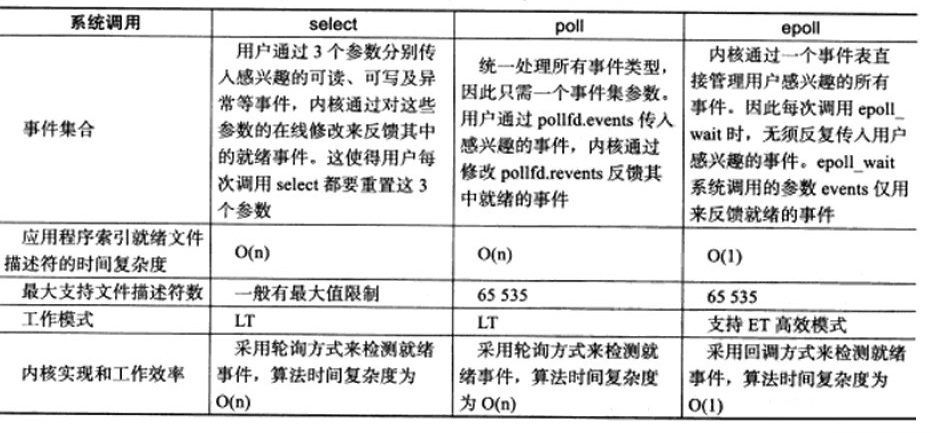

## Linux

[全家桶](https://github.com/CyC2018/CS-Notes/blob/master/notes/Linux.md#awk)

1. fork()区分父子进程？

子进程返回值0，父进程返回子进程id

2. select? poll? epoll?

[RBtree](https://zhuanlan.zhihu.com/p/93609693)
epoll不会让每个socket的等待队列都添加进程A引用，而是在等待队列，添加eventPoll对象的引用。
当socket就绪时，中断程序会操作eventPoll，在eventPoll中的就绪列表(rdlist)，添加scoket引用。
这样的话，进程A只需要不断循环遍历rdlist，从而获取就绪的socket。
从代码来看每次执行到epoll_wait，其实都是去遍历 rdlist。

如果rdlist为空，那么就阻塞进程。
当有socket处于就绪状态，也是发中断信号，再调用对应的中断程序。
此时中断程序，会把socket加到rdlist，然后唤醒进程。进程再去遍历rdlist，获取到就绪socket。

总之： poll是翻译轮询的意思，我们可以看到poll和epoll都有轮询的过程。
不同点在于：
poll轮询的是所有的socket。
而epoll只轮询就绪的socket。

## Shell

[全家桶](https://cloud.tencent.com/developer/article/1450329)
