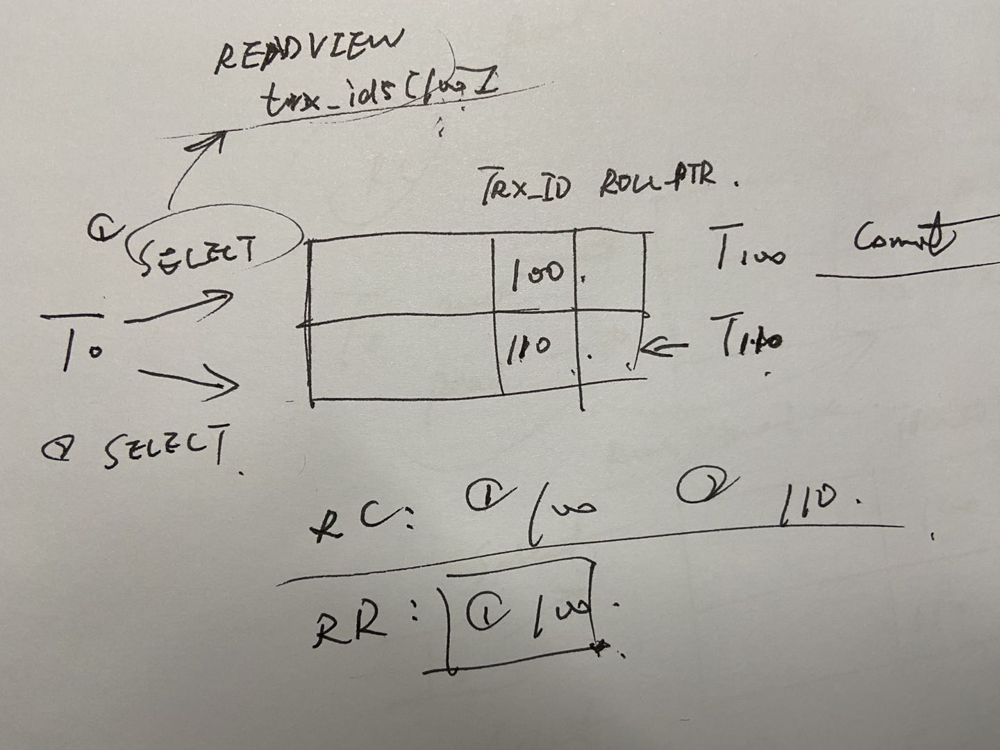

1. 数据库三大范式说一下？

```mysql
/* 建表规范 */ ------------------
    -- Normal Format, NF
        - 每个表保存一个实体信息
        - 每个具有一个ID字段作为主键
        - ID主键 + 原子表
    -- 1NF, 第一范式
        字段不能再分，就满足第一范式。
    -- 2NF, 第二范式
        满足第一范式的前提下，不能出现部分依赖（某一列不依赖于主键）。
        消除复合主键就可以避免部分依赖。增加单列关键字。
    -- 3NF, 第三范式
        满足第二范式的前提下，不能出现传递依赖。
        某个字段依赖于主键，而有其他字段依赖于该字段。这就是传递依赖。
        将一个实体信息的数据放在一个表内实现。
```

2. mysql的存储引擎以及他们的区别？

最常用的是InnoDB和MyISAM，其他的还有Archive, CSV等等。InnoDB是MySql的默认存储引擎。

简单说下前两者区别：
- 是否支持事务和奔溃恢复。InnoDB提供事务支持，外键等高级数据库功能，提供了具有提交、回滚、崩溃恢复能力的事务安全；
MyISAM强调性能，查询具有原子性，速度一般比I更快，但不提供事务支持。
- 是否支持行级锁：M是表级锁，I支持行级锁（默认）和表级锁
- 是否支持MVCC：I支持。应对⾼并发事务, MVCC⽐单纯的加锁更⾼效; MVCC只在 READ COMMITTED 和 REPEATABLE READ 两个隔离级别下⼯作;MVCC可以使⽤ 乐观 (optimistic)锁 和 悲观(pessimistic)锁来实现;
- 外键支持：I支持，M不支持
- 全文索引支持：I不支持，M支持

3. 索引的类型？mysql 索引是怎么实现的？两种存储引擎对实现索引的区别？

InnoDB支持的索引：主键索引(PRIMARY)，普通索引(INDEX)，唯一索引(UNIQUE)，组合索引，全文索引(FULLTEXT)。总体划分为两类，主键索引也被称为聚簇索引（clustered index），其余都称呼为非主键索引也被称为二级索引（secondary index）。

Btree索引和Hash索引。需求为单条记录查询可以使用hash且不能使用除=之外的判断。hash不支持顺序和范围查询是最大的缺点。

两种引擎都是使用B+tree。[图文](https://www.jianshu.com/p/3a1377883742)

- InnoDB：数据文件本身就是主索引文件，按照B+tree结构组织文件，因此每个叶子结点存储就是完整的数据记录，
索引的key就是主键，被称为聚集索引，搜索主键非常高效。辅助索引叶子结点存储的是主键值，因此需要再查一次。
- MyISAM：叶子结点data域存放的是数据记录的地址，查询的时候需要取出地址再按地址查询记录。称为非聚集索引。

4. BTree和B+Tree的区别？

- B+只有叶子结点带指向记录的指针，B内部节点也带，在内部节点出现的索引不会再在B的叶子结点出现
- B+所有叶子结点都通过指针连接在一起

B+优点：
- 非叶子结点不存指针，可以容纳更多索引项，使得内部结点可以定位更多的叶子结点，降低树的高度，从而提升索引查询效率
- 范围扫描很方便，直接在叶子结点进行扫描即可，B树则需要在叶子和内部节点之间来回移动

B优点：对于内部节点可以直接获得，不需要到叶子结点才能获取

5. 索引覆盖了解吗？解释一下为什么要用？

覆盖索引（covering index ，或称为索引覆盖）即从非主键索引中就能查到的记录，而不需要查询主键索引中的记录，避免了回表的产生减少了树的搜索次数，显著提升性能。

6. 事务？特性？讲一下ACID?

事务是逻辑上的一组操作，要么都执行，要么都不执行。
- 原子性（Atomicity）： 事务是最小的执行单位，不允许分割。事务的原子性确保动作要么全部完成，要么完全不起作用；
- 一致性（Consistency）： 执行事务前后，数据保持一致，多个事务对同一个数据读取的结果是相同的；
`应用系统从一个正确的状态到另一个正确的状态.而ACID就是说事务能够通过AID来保证这个C的过程.C是目的,AID都是手段。`
- 隔离性（Isolation）： 并发访问数据库时，一个用户的事务不被其他事务所干扰，各并发事务之间数据库是独立的；
- 持久性（Durability）： 一个事务被提交之后。它对数据库中数据的改变是持久的，即使数据库发生故障也不应该对其有任何影响。

7. 并发事务带来哪些问题?

- 脏读：t1访问db数据进行了修改但还未提交，t2访问使用了这些数据；
- 丢失修改：类似cas里的aba问题，多个事务对同一个数据修改，会导致修改被覆盖丢失；
- 不可重复读：t1多次读取同一数据，但t2访问该数据并做了修改，导致t1多次读的时候发现同一数据不一样了。
- 幻读：t1读取同一数据，t2添加了一些数据，t1多次读发现多了一些原来不存在的数据。

8. 事务隔离机制讲一下？分布怎么实现的？

- read uncommitted: 允许读取未提交的数据更改；完全不加锁，性能最高，但是隔离性为0；
- read committed: 允许读取事务已提交的数据；
- **repeatable read**(默认的隔离级别): 对同一字段的数据多次读取都是一样的，除非数据被本事务修改；
- serializable: 完全服从ACID, 事务依次串行；读的时候加共享锁S，写的时候加排它锁S。

**MVCC**: [官方文档](https://dev.mysql.com/doc/refman/8.0/en/innodb-multi-versioning.html), [简洁正确解释](https://juejin.im/post/5cdbfec051882515cc7e4afd)

多版本并发控制，主要是用来实现事务并发的RC和RR隔离。
InnoDB会给每条记录的后面加三个新的字段:`DB_TRX_ID, DB_ROLL_PTR, DB_ROW_ID`
- `DB_TRX_ID`：记录最后一个操作该条记录的事务id（Insert或者Update）
- `DB_ROLL_PTR`：指针指向undo log（可以恢复到该条记录update之前的状态）
- `DB_ROW_ID`：没有指定之间的时候，使用该字段生成聚簇索引

在RC和RR事务执行之前，InnoDB的都会先生成一个ReadView。
ReadView就是生成一个列表存储当前事务开始的时候引擎中活跃的读写事务id，存放在`trx_ids`列表中，再通过判断
`DB_TRX_ID`和列表中id判断当前事务是否可读可写。

区别这两种隔离模式就是根据它们生成ReadView的策略来的。
- RC每次都会生成一个新的ReadView，因此读取的都是已提交的事物的最新结果
- RR在一次事务里只生成一个ReadView，一次对同一字段读的都是一样的，除了被自己事务修改


9. **索引优化有哪些方法？**

- Multi-range Read：减少磁盘的随机访问，转化为顺序访问，适用于range之类的条件sql
- Index Condition Pushdown(ICP)：索引下推，英文名更好理解，条件下推，就是把where条件语句的判断时机提前到了在引擎检索阶段。
传统的是先把数据取出来再filter。适用于range、ref等语句。

[索引的特点、优缺点](https://juejin.im/post/5da5b61e518825798038f072#heading-2)

10. 大表优化有哪些策略？

- 限定查询范围，先查时间段内数据再查相关信息等（inner join)
- 读写分离，主数据库写，从负责读
- 垂直分区：提高I/O效率，但会出现主键冗余带来管理的麻烦
- 水平分区：数据切割，多个数据库来存储，适用于数据量很大的情况，但带来了id主键处理、部署等难题

11. 问题排查手段一般有哪些？

- `show processlist`查看当前所有连接信息；
- `explain`查询sql语句的执行计划（有没有使用index之类的）；
- 开启慢查询日志，定位执行最耗时的语句进行优化

12. 性能优化的常用手段？

- 选择正确的存储引擎。尽量使用InnoDB；
- 优化字段的数据类型。如使用tinyint代替int，建索引的时候也可以进一步优化varchar最大长度之类；
- 为常搜索的字段建立索引，覆盖索引等；
- 避免使用select *；
- 使用enum代替varchar，结构紧凑检索快；
- 字段就可能not null，null需要额外的存储空间；
- 采用固定长度的表
- 。。。。。

13. **数据库的锁分类？锁算法？简单说说** [详细](https://blog.csdn.net/qq_34337272/article/details/80611486)

按照粒度划分：
- 行锁：**基于index，不用index只会用表锁**
    - 共享锁S：读锁，只允许事务并发读取上了锁的资源，无法修改，且无法和排它锁一起加 （... lock in share mode）
    - 排他锁X：写锁，只允许加锁的事物读和写，其他事务无法访问数据，会阻塞其他所有类型锁，防止其他锁上写锁 （for update）
- 表锁（读写锁无法同时存在）：
    - 共享锁S：读锁，只允许事务并发读取上了锁的资源，无法修改，且无法和排它锁一起加 （... lock in share mode）
    - 意向共享锁IS: 表示事务准备加S，事务在加S之前一定要获取IS
    - 排他锁X：写锁，只允许加锁的事物读和写，其他事务无法访问数据，会阻塞其他所有类型锁，防止其他锁上写锁 （for update）
    - 意向排它锁IX：表示事务准备加X，事务在加X之前一定要获取IX
- 页级锁：开销和加锁时间界于表锁和行锁之间；**会出现死锁**；锁定粒度界于表锁和行锁之间，并发度一般


锁算法：
- Record Lock：对index加锁，锁符合条件的行。
- Gap Lock：锁定记录的范围。
```text
三条记录a,b,c，因为是按照数据大小排序，因此事务修改b的时候，区间[a, b),(b, c]都会被加锁
```
- **Next-Key Lock（读取行时采用）：record+gap，锁定index记录本身和索引范围，解决了幻读**
  
```text
除了select是读锁S，其他操作都是写锁X
意向锁是InnoDB自动加的，不需要用户干涉   
一张表IS可以同时存在多个（因为读可以多个事务并发），IX只可以存在一个。
```


14. MySQL为什么会死锁？怎么解决？[参考](https://www.cnblogs.com/zejin2008/p/5262751.html)

首先，表锁是不会产生死锁的。
行锁是基于索引的，当查询没有使用索引的时候，就使用表锁。行锁是针对索引加锁而不是数据记录，因此访问不同的数据记录但使用了同一index也可能导致锁冲突。
MyISAM是一次性获得所有锁，InnoDB是逐步获取，因此就可能产生两个事物互相请求对方的锁，从而产生死锁。

解决：
- 尽可能一次性获得事物所需的所有锁，破坏互斥
- 尽可能用表锁
- 对数据排个序，尽可能让事物并发时按照相同的顺序访问表

15. **SQL语句执行的过程？**

大体流程如下：
- 客户端：发送sql请求
- 服务端：
    - 连接器：身份验证和权限登录
    - 查询缓存
    - 分析器：词法分析，语法分析
    - 优化器：选择最优的执行方案
    - 执行器：调用引擎接口执行查询
- 引擎端：执行实际查询

select查询语句大致如上，**修改数据**操作则需要涉及到redolog，binlog，undolog，在上述流程执行结束的基础上还有
**redolog prepare - binlog - redolog commit**的过程（为了保证记录一致性所以多了这个阶段）

- binlog: Mysql Sever级别的归档日志，所有存储引擎都拥有，主要用于主从数据库的同步和复制。
- redolog：只有InnoDB拥有，也是它拥有crash-safe能力的原因，记录的是物理日志（记录每个页的修改），主要用来实现重做，保证数据库事务的持久性，每次重启服务都会按redolog重做。
- undolog：和redolog类似，不过是记录的**逻辑日志**（记录一条反向操作），主要用来实现MVCC、回滚等

**16. 项目中翻页太慢你怎么解决的?**

- 排查是不是数据库内存分配的不够
- 看一下有没有用index,判断能否使用index提高效率
- 看慢查询日志,定位最耗时的sql语句,主要原因是因为limit offset,size语句是把(offset+size)前面所有数据都查出来再过滤的,翻页翻到后面很自然效率极差
采用inner join来优化,主要是限定时间字段段范围来查询(更高效的是用主键索引的范围直接查,不需要二次查找)
```mysql
select * from A as a inner join (select b.ID from B as b limit 10000, 1000) on a.ID = b.ID;
```
- 尝试index优化,ICP边查边过滤
- 大招:分库/分表

17. 为什么要使用数据库连接池？

- 提高资源利用率：避免频繁创建和销毁连接带来的资源损耗（网络连接损耗、数据库身份验证等损耗）
- 提高响应速度：直接走连接池中拿连接直接进行服务
- 均衡资源分配：设置最大连接数防止某个应用独占资源
- 统一的资源管理：防止数据库连接泄露


