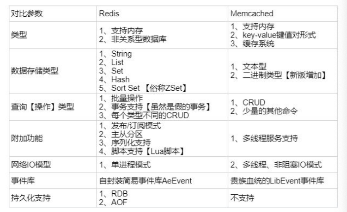

1. 数据类型？怎么用？

- List：
- String：
- Hash：
- Set：
- ZSet：

2. 为什么要用Redis？优缺点？

- 高性能：Redis的设计思想和OS中CPU寻址的思想差不多，也就是Cache缓存，运行在内存中，C语言编写，与传统RDB相比读写速度更快
- 高并发：由于Cache的存在，用户请求就可以不用落到数据上，转由性能高的cache来处理，有效的支持高并发

优点：
- 读写速度非常快因为使用内存读写
- 支持数据持久化
- 操作是原子性的，奔溃可恢复
- 数据类型丰富
- 丰富的特性：key expired， publish/subscribe、notify
- 节点集群，很容易将数据分布到多个Redis实例中

缺点：
- 受物理内存的限制，无法对海量数据进行高性能读写
- 适合的场景主要局限在较小数据量的高性能操作和运算上

3. Redis和Memcached区别？

- 数据结构：5种，字符串
- 性能：单线程小数据量前者优秀，大数据后者优秀
- 持久化：支持; 全部存在内存中
- 线程模型：单线程模型，基于非阻塞的IO多路复用；多线程，master-worker
- 灾难恢复：可通过aof恢复；不可恢复
- 集群：支持；不支持

4. Redis使用单线程模型(file event handler， feh)为什么性能依然很好？

- 没有线程切换的资源消耗
- 没有资源共享和竞争，不需要加锁
- 基于内存读写，速度很快
- **使用非阻塞的IO多路复用（epoll)**来监听多个socket，并分配到相应的feh上处理
- 数据结构的性能较高，动态数组list，跳表实现的zset等

5. 持久化机制？区别？

- RDB(默认):
创建某个时间节点上的数据快照，然后存储到*.rdb文件中，方便服务器重启使用，也方便其他redis服务器读取和创建
```config
save 900 1           #在900秒(15分钟)之后，如果至少有1个key发生变化，Redis就会自动触发BGSAVE命令创建快照。
save 300 10          #在300秒(5分钟)之后，如果至少有10个key发生变化，Redis就会自动触发BGSAVE命令创建快照。
save 60 10000        #在60秒(1分钟)之后，如果至少有10000个key发生变化，Redis就会自动触发BGSAVE命令创建快照。
```
时间间隔设置过大，如果发生数据丢失就没办法恢复

- AOF(主流):
将更改数据的操作写入AOF文件，支持[rewrite](https://snailclimb.gitee.io/javaguide/#/docs/database/Redis/redis-all?id=redis-%e6%8c%81%e4%b9%85%e5%8c%96%e6%9c%ba%e5%88%b6%e6%80%8e%e4%b9%88%e4%bf%9d%e8%af%81-redis-%e6%8c%82%e6%8e%89%e4%b9%8b%e5%90%8e%e5%86%8d%e9%87%8d%e5%90%af%e6%95%b0%e6%8d%ae%e5%8f%af%e4%bb%a5%e8%bf%9b%e8%a1%8c%e6%81%a2%e5%a4%8d)
```config
appendfsync always    #每次有数据修改发生时都会写入AOF文件,这样会严重降低Redis的速度
appendfsync everysec  #每秒钟同步一次，显示地将多个写命令同步到硬盘
appendfsync no        #让操作系统决定何时进行同步
```
AOF 的持久化文件比 RDB 大，恢复速度慢


6. 过期建删除的策略？

- 定期删除：每隔100ms**随机**选一些键检查是否过期，过期就删除
- 惰性删除：不主动删除，只有当使用的key发现过期的时候才删除

7. 内存淘汰机制？（回收机制）

- volatile-lru：从已设置过期时间的数据集（server.db[i].expires）中挑选最近最少使用的数据淘汰
- volatile-ttl：从已设置过期时间的数据集（server.db[i].expires）中挑选将要过期的数据淘汰
- volatile-random：从已设置过期时间的数据集（server.db[i].expires）中任意选择数据淘汰
- **allkeys-lru：当内存不足以容纳新写入数据时，在键空间中，移除最近最少使用的 key（这个是最常用的）**
- allkeys-random：从数据集（server.db[i].dict）中任意选择数据淘汰
- no-eviction：禁止驱逐数据，也就是说当内存不足以容纳新写入数据时，新写入操作会报错。这个应该没人使用吧！

4.0 版本后增加以下两种：
- volatile-lfu：从已设置过期时间的数据集(server.db[i].expires)中挑选最不经常使用的数据淘汰
- allkeys-lfu：当内存不足以容纳新写入数据时，在键空间中，移除最不经常使用的 key


8. 说说Redis的同步(复制)机制？

- sync：**节点机主动**发送sync信号，主机接收到信号后bgsave一个rdb文件，同时在缓冲区记录新的写指令，结点在接收到rdb
文件并更新完成之后，主机再发送缓冲区的指令知道主从数据库状态一致
- 指令同步（command propagation）：主机数据修改后会**主机主动**向从结点发送执行的指令保证同步
- psync：（partial sync）记录传输的偏移量等信息，支持断点续传

9. Redis有哪些功能？适用场景说几个？

- 会话缓存（秒杀活动：把商品数据提前放到缓存中）
- 排行榜和计数器：Redis 在内存中对数字递增、递减的操作实现的非常好。Set 和 Sorted Set 使得我们在执行这些操作的时候非常简单
- [发布和订阅](https://redisbook.readthedocs.io/en/latest/feature/pubsub.html)：可以实现一个生产者，多个消费者

10. [Redis事务](https://redisbook.readthedocs.io/en/latest/feature/transaction.html#id2)

Redis 通过 MULTI 、 DISCARD 、 EXEC 和 WATCH 四个命令来实现事务功能。
符合ACID，无法rollback，事务不可嵌套。

11. 缓存穿透？怎么解决？

大量请求的key不在缓存中，导致请求全部落在数据库让数据库处理。

解决：
- 参数校验，直接过滤掉非法参数的请求
- 缓存无效key到缓存中，设置个较短的ex
- bloom filter：先过滤掉海量数据（DB）中不存在的key，再查询

12. 缓存雪崩？怎么解决？

同一时间，大面积的缓存失效（很多数据ex刚好同时到期），导致请求直接落到数据库上。

解决：
- **随机设置个ex的float factor，这样失效时间不会太密集**
- **Redis集群，不怕宕机**
- 用MQ限流，避免同时处理大量请求

13. 如何解决Redis并发竞争key的问题？

加分布式锁。
分布式锁重点在于互斥性，在任意一个时刻，只有一个客户端获取了锁。分布式锁：ZooKeeper，Redis,DB

14. 如何用redis实现分布式锁？有哪些缺陷？

- 基于Redis的实现：
    - 使用Lua脚本（SETNX + EXPIRE)
    - set key value 加参数 `SET key value[EX seconds][PX milliseconds][NX|XX]`
    - Redlock(Java中用Redission实现) 有点类似ReentrantLock
    
- [缺陷](https://snailclimb.gitee.io/javaguide/#/docs/database/Redis/redis-collection/Redis(3)%E2%80%94%E2%80%94%E5%88%86%E5%B8%83%E5%BC%8F%E9%94%81%E6%B7%B1%E5%85%A5%E6%8E%A2%E7%A9%B6?id=redis-%e5%88%86%e5%b8%83%e5%bc%8f%e9%94%81%e7%9a%84%e9%97%ae%e9%a2%98)：
    - 锁超时
    - 单点/多点
    
15. Redis如何做内存优化？[参考](https://cloud.tencent.com/developer/article/1162213)

- 缩减key-value长度
- 共享对象池：[0-9999]的整数对象池，开发中尽量使用整数对象节省内存
- 多使用hash
- 编码优化，控制编码类型
- 控制key的个数
    
    
epoll?

Redis 为什么用跳表而不用平衡树？

redis中sorted set的实现是这样的：
  [优质解答](https://juejin.im/post/57fa935b0e3dd90057c50fbc#heading-1)
- 当数据较少时，sorted set是由一个ziplist来实现的。
- 当数据多的时候，sorted set是由一个dict + 一个skiplist来实现的。简单来讲，dict用来查询数据到分数的对应关系，而skiplist用来根据分数查询数据（可能是范围查找）。

redis rehash过程？